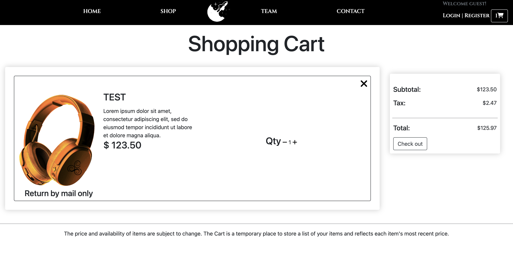

# [Control Intelligence](http://www.ctrlintel.shop/)

In this project we built an ecommerce website that is supported with backend capabilities such as a MySQL database to keep track of inventory. We have also built an app that can only be accessed by employees that is used to track company revenue, progression, and marketing information. 

This project was completed for the purpose of CS 3250 (Software Developement Methods and Tools) at Metropolitan State University of Denver.

# Required Modules

You'll need to make sure you havce the lastest version of pip installed

```
python -m ensurepip --upgrade
```

To install required modules for django, run this command **INSIDE** of the virtual environment:

```
pip install -r requirements.txt
```


# Using the project

To use the project the user will have to input the values for their database whether it is remote or local. 
For the web side this will be in the settings.py file and the GUI side will be in the dbscript.py file.

When the database is connected the user can run the web host in a virtual environment and go to "localhost:8000" in their browser.
To use the GUI side run the main.py file and you will have to create a user before being able to sign in.

# Supported Modules
## Landing Page


Features: 

* A navigation bar and footer with various options start here and are available throughout the entire site

* At the bottom of the page there are featured products based on the user's purchase history

* Within the featured section, items are able to be added to the shopping cart from here 


## Login Page

Features: 

* User is able to provide their account details to log in

* A forgotten password link is readily available in case the user forgot their password

* If the user does not have an account yet, a sign up button is available from this page


## Sign Up Page

Features: 

* User is able to provide their details to create an account

* If the user already has an account, a log in link is available from this page

## Contact Us Page

Features: 

* Contact form that allows the user to enter their full name, email, and a message

* With the click of the submit button the user's information along with the message gets sent to the company's email

## Shop Page

Features: 

* Displays the number of items in the shop

* Display current items on inventory with name and price

* Each item's card can be clicked to access more information about the item

* Each item is able to be added to the shopping cart with the Add to Cart button

## Cart Page

Features: 

* Items added to the shopping cart are viewable in this page along with their name, description, price, and quantity

* The quantity of the item is able to be changed through here

* Subtotal, tax, and total are displayed here and change accordingly to the addition or deletion of items

* The checkout button directs you to the checkout page

## Checkout Page

Features:

* User is able to provide shipping information such as their address

* Subtotal, tax, and total are also displayed here

* Order summary displays the items the user is about to purchase

## Payment Page


Features:

* User's shipping address is displayed

* Payment method is displayed

* Items are displayed for the user to review

* Subtotal, tax, and total price are displayed

* Paypal is integrated to handle user purchase


## Dashboard Page


Features:

* User is able to browse their orders

* User is able to edit their profile

* User is able to request a refund for a recently purchased item


# Credits

This project has been worked on by:

Tho Le, Brian Vasquez, Cameron Spear, Matthew White, Seth Hamilton

# License

Shield: [![CC BY 4.0][cc-by-shield]][cc-by]

This work is licensed under a
[Creative Commons Attribution 4.0 International License][cc-by].

[![CC BY 4.0][cc-by-image]][cc-by]

[cc-by]: http://creativecommons.org/licenses/by/4.0/
[cc-by-image]: https://i.creativecommons.org/l/by/4.0/88x31.png
[cc-by-shield]: https://img.shields.io/badge/License-CC%20BY%204.0-lightgrey.svg

